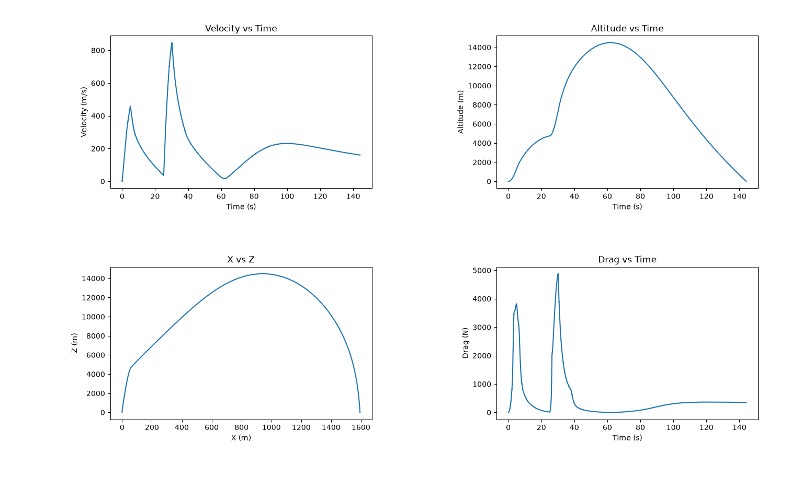
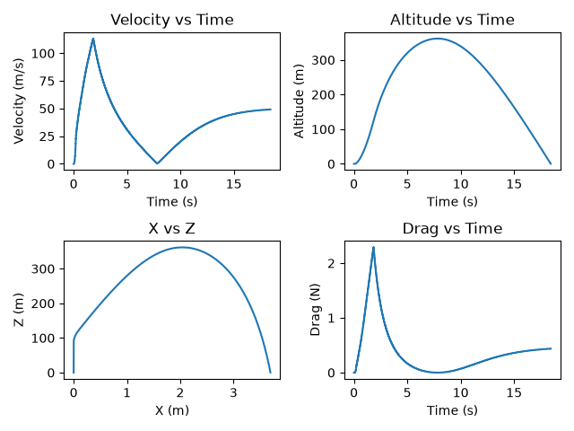

[](https://github.com/Oversimplistic/RocketsRefined/actions/workflows/tests.yml)
# Rockets Refined - A Trajectory Simulator for Sounding Rockets

A physics-based sounding rocket simulator written in Python, using RK4 numerical integration to model powered ascent under thrust, drag, gravity, and a standard atmosphere model.

## Overview

This project simulates an n-stage rocket's 2D flight, using real motor thrust-curve data and the 1976 ISA standard atmosphere model for air density. State (position, velocity, mass) is integrated forward in real time using 4th-order Runge Kutta.

Built as a personal project to combine and expand my knowledge of numerical methods, flight mechanics, and general software engineering practice ahead of starting my engineering degree.

## Sample Output



*Velocity, altitude, trajectory, and drag for a sample two-stage, two-dimensional flight, as auto-generated by the simulation.*

## Validation



*Validated against a physical test flight using an Estes C6-5 motor, chosen for availability of flight data and relative simplicity. Drag coefficient was fixed at 0.6 to reflect the rocket's poor aerodynamic finish (estimated, not fitted to match the result). Simulated apogee came within 3% of the measured value.*

*Small, cheap motors were deliberately chosen over a larger sounding rocket for this first validation pass — there is lots of public telemetry and their published thrust curves are independently checkable, making the comparison more verifiable.*

## Features

- RK4 Integration of motion equations
- Motor-thrust curve interpolation of real-world data
- Prescribed gravity turn and downrange modelling/tracking
- Mass-flow modelling from thrust and specific impulse (Isp)
- Support for n stages using different rocket motors
- ISA-based atmospheric density model (drag varies with altitude)
- Altitude-dependent gravity
- Flight event tracking (max altitude, max velocity, max dynamic pressure, burnout)
- Automatic plotting of data (altitude, downrange motion, velocity, thrust, and drag)

## Current Limitations

- Only a two-dimensional ascent profile - no lateral motion yet
- No wind or dispersion modelling
- Only partially validated against real flight data (exclusively subsonic validation)

## How to run

```bash
python main.py
```
This runs the simulation until the rocket returns to the ground, prints a flight summary, and graphs key data.

## Requirements

- Python 3.x
- numpy
- matplotlib
- pytest (for running unit tests)

## Testing

Unit tests are written using `pytest` and live in `unittests.py`.

To run the tests:

```bash
pytest unittests.py
```

or, for more detail:

```bash
pytest unittests.py -v
```

## Roadmap

- [x] Add 2D capability (downrange distance)
- [x] Add a prescribed gravity turn for proof of concept
- [x] Transonic drag, etc. (Placeholder values)
- [ ] Extend to 3D (lateral tracking)
- [ ] Add aerodynamic-driven gravity turn logic
- [x] Multi-stage support
- [x] Unit testing for physics functions
- [ ] Monte Carlo dispersion analysis (wind, thrust variance)
- [x] Validation against real subsonic fight telemetry
- [ ] Validation against real supersonic flight telemetry (Partially Complete)

## Key Learnings

- Numerical Methods (4th-order Runge-Kutta, etc.)
- Debugging
- Object Orientated Programming
- Git integration
- Unit testing with pytest
- Variable drag coefficients and angles of attack.


